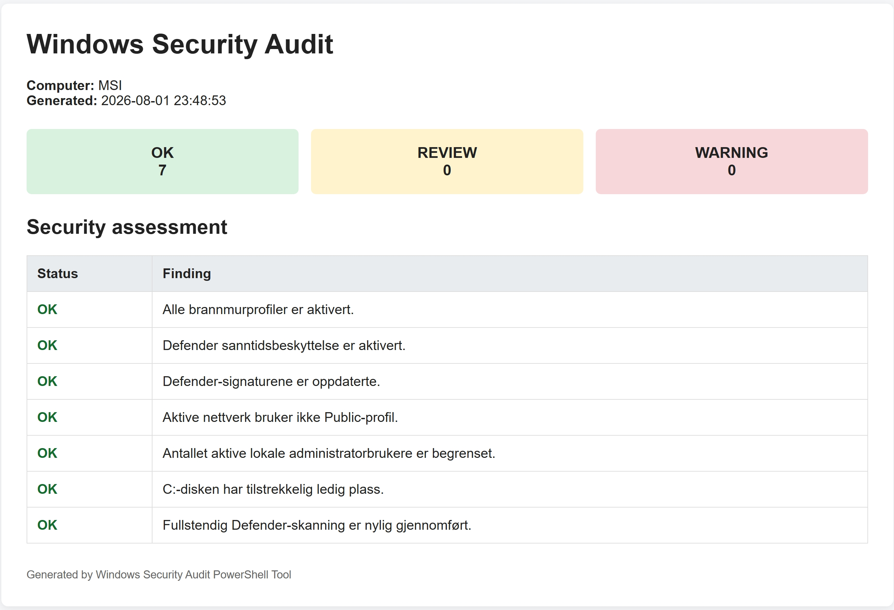

# Windows Security Audit

A PowerShell project that collects system information and performs a basic security assessment of a Windows computer.

The project was created as a practical exercise in PowerShell, Windows administration, networking, and basic cybersecurity.

## Purpose

The goals of the project are to:

- collect relevant system information automatically
- check basic security settings
- identify possible security risks
- document the system status in a readable report
- practise PowerShell pipelines, objects, and automation

## Features

The PowerShell script collects information about:

- operating system and build number
- active network adapters
- IPv4 and IPv6 addresses
- default gateway and DNS servers
- active network profile
- Windows Firewall
- Microsoft Defender
- local user accounts
- members of the local Administrators group
- available disk space
- active TCP connections
- processes that own the network connections

The script also performs an automatic security assessment of:

- firewall status
- Microsoft Defender real-time protection
- Defender signature age
- active network profile
- enabled local administrator accounts
- available space on the system drive
- age of the latest full Defender scan
- age of the latest installed Windows update

The assessment results are classified as:

- `OK`
- `REVIEW`
- `WARNING`

## Report Preview

The tool generates a local HTML report with a summary of the security findings.



## Project Structure

```text
Windows-Security-Audit/
├── Windows-Security-Audit.ps1
├── systemrapport.txt
├── security-report.html
├── docs/
│   └── security-report-preview.jpeg
└── README.md

